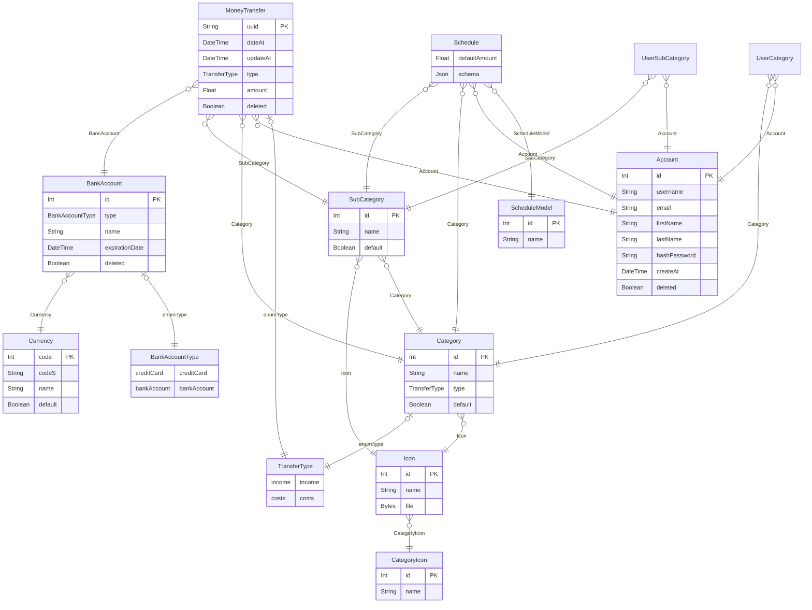

```mermaid
erDiagram

        BankAccountType {
            creditCard creditCard
bankAccount bankAccount
        }
    


        TransferType {
            income income
costs costs
        }
    
  CategoryIcon {
    Int id PK 
    String name  
    }
  

  Icon {
    Int id PK 
    String name  
    Bytes file  
    }
  

  Currency {
    Int code PK 
    String codeS  
    String name  
    Boolean default  
    }
  

  Category {
    Int id PK 
    String name  
    TransferType type  
    Boolean default  
    }
  

  SubCategory {
    Int id PK 
    String name  
    Boolean default  
    }
  

  BankAccount {
    Int id PK 
    BankAccountType type  
    String name  
    DateTime expirationDate  
    Boolean deleted  
    }
  

  Account {
    Int id PK 
    String username  
    String email  
    String firstName  
    String lastName  
    String hashPassword  
    DateTime createAt  
    Boolean deleted  
    }
  

  UserCategory {

    }
  

  UserSubCategory {

    }
  

  MoneyTransfer {
    String uuid PK 
    DateTime dateAt  
    DateTime updateAt  
    TransferType type  
    Float amount  
    Boolean deleted  
    }
  

  ScheduleModel {
    Int id PK 
    String name  
    }
  

  Schedule {
    Float defaultAmount  
    Json schema  
    }
  
    Icon o{--|| CategoryIcon : "CategoryIcon"
    Category o{--|| Icon : "Icon"
    Category o|--|| TransferType : "enum:type"
    SubCategory o{--|| Category : "Category"
    SubCategory o{--|| Icon : "Icon"
    BankAccount o|--|| BankAccountType : "enum:type"
    BankAccount o{--|| Currency : "Currency"
    UserCategory o{--|| Account : "Account"
    UserCategory o{--|| Category : "Category"
    UserSubCategory o{--|| Account : "Account"
    UserSubCategory o{--|| SubCategory : "SubCategory"
    MoneyTransfer o|--|| TransferType : "enum:type"
    MoneyTransfer o{--|| Account : "Account"
    MoneyTransfer o{--|| Category : "Category"
    MoneyTransfer o{--|| SubCategory : "SubCategory"
    MoneyTransfer o{--|| BankAccount : "BancAccount"
    Schedule o{--|| ScheduleModel : "ScheduleModel"
    Schedule o{--|| Account : "Account"
    Schedule o{--|| Category : "Category"
    Schedule o{--|| SubCategory : "SubCategory"
```
